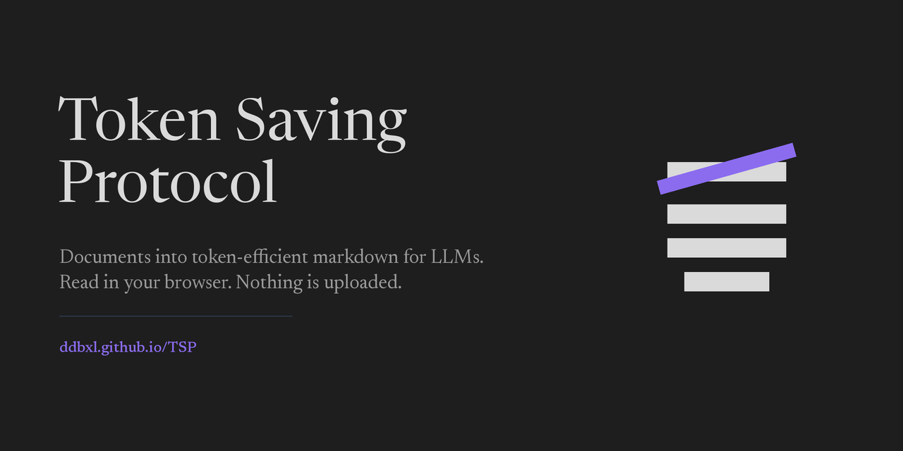

# TSP, Token Saving Protocol

**[Open it in your browser](https://ddbxl.github.io/TSP/)**, or install it and
work from the desktop.

Feed TSP a PDF and get back compact text, plus images of the pages that carry
their meaning in charts rather than words. Your files stay on your machine.

A 90-page report repeats its header on 90 pages, its footer on 90 pages, and
sets its quotation marks in curly glyphs that cost two tokens each. You pay for
all of it when you paste that report into an LLM. TSP strips the repetition,
rejoins words broken across line breaks, and prints the before and after count
so you can see what came off.



## In your browser

### <https://ddbxl.github.io/TSP/>

Nothing to install. Drop PDFs on the page and take the text away. Your documents
stay where they sit. No server sees them, and none needs to.

The same `core.py` that runs on the desktop runs there, as WebAssembly through
[Pyodide](https://pyodide.org). It loads as the page opens, on a worker thread,
so the 28 MB arrives while you are choosing files rather than after. On a
connection the browser reports as metered or very slow it waits, and adding a
file starts it.

A 100-page report takes about 2.3 seconds there against 1.0 second on the
desktop.

### Taking the result away

Each finished document carries its own actions, with the same actions for
everything at once beneath them:

| | Good for |
|---|---|
| **Copy text** | Pasting straight into a chat. No file, no unpacking. |
| **Download text** | One `.md`. Per document, or every document joined. |
| **Download files** | That document's text, manifest and page images as a zip. |
| **Save every file to a folder** | Everything onto disk. Chrome, Edge and Opera. |
| **Download everything as a zip** | The same, on browsers without folder access. |

Downloads keep the source name with a marker in front, so
`S3_Study_Final_Report.pdf` gives `optimised_S3_Study_Final_Report.md` and sorts
beside its original.

Chrome refuses to write to certain folders, Downloads among them, and reports
that the same way as a cancelled dialogue, so the page cannot tell the two apart.
It opens the picker in Documents for that reason and says so if nothing gets
saved.

Finished files stay in the queue. Change a setting on one and it queues again;
change nothing and the button offers Process again. Neither needs the file
re-picked.

## On your desktop

Worth installing for large batches, for scripting, and for anywhere a 28 MB
download on each new machine is a nuisance.

```bash
git clone https://github.com/ddbxl/TSP.git
cd TSP
pip install -e .
```

Python 3.10 or later. The one dependency is [PyMuPDF](https://pymupdf.readthedocs.io).

Open the window:

```bash
tsp-gui
```

Add PDFs, set a mode per file, press Process. The window stays responsive while
work happens on a background thread, and Cancel stops at the next page.

Or stay on the command line:

```bash
tsp report.pdf                      # 5% threshold, 144 dpi
tsp *.pdf --threshold 20 --dpi 200
tsp deck.pdf --text-only -o ./extracted
tsp report.pdf --keep-headers       # leave running headers alone
```

`tsp --help` lists the rest.

## Modes

The threshold sets how much of a page raster images must cover before TSP saves
that page as a PNG alongside its text.

| Mode | Threshold | Suits |
|---|---|---|
| Text documents | 5% | Reports, legislation, studies |
| Mixed reports | 20% | Prose with figures dropped between sections |
| Slide decks | 50% | Presentations where the slide *is* the graphic |
| Text only | 100% | Skip images and take the text |

Two cases the threshold alone misses, both handled: a corner logo repeating on
every page stays under a floor of 0.4% and triggers nothing, while a chart drawn
in vector paths holds no raster image at all and gets caught by a path count
instead.

## Scanned pages

TSP spots a page holding an image and no text layer, counts them, and offers to
read them rather than handing you an empty file.

**In the browser**, a scanned page brings up a language picker and a button.
Tesseract arrives as WebAssembly the first time, about 7 MB for the engine and
one language model, then stays cached. Recognition takes about a second a
page. The page images never leave the machine: only the language model comes down
from Tesseract's own repository.

**On the desktop**, tick **Read scans (OCR)** or pass `--ocr`, which uses
Tesseract through PyMuPDF at about 1.4 seconds a page. Tesseract 5 and its
language data need their own install there, and TSP bundles neither.

Either way the recognised words go through the same cleaning as a text layer, so
a word Tesseract split across two lines comes back whole.

No cloud service touches any of this, and none will. An online OCR API
would mean posting your documents to somebody else's server, which is the one
thing this tool exists to avoid.

## Tables

Off by default. Tick **Tables** on a file, or pass `--tables`, and detected
tables come out as markdown grids:

```
|Region|R&D|Patents|SMEs|Employ.|Index|
|---|---|---|---|---|---|
|Bratislavsky kraj|1.82|412|18,430|62.1|0.71|
```

TSP drops the text blocks inside a table in favour of the grid, so cells appear
once rather than twice. Measured on a six-column indicator table, a grid costs
231 tokens against 224 for the same content in reading order, so about 3% more.

The cost is time. Detection made a 100-page report go from 1.4 to 4.3 seconds,
which is why it stays off unless asked for.

Reading order already handles simple grids. Reach for this when cells are empty,
wrap onto two lines, or sit under merged headers, because reading order then
misaligns columns without saying so.

## What comes out

```
report.pdf
report_TSP/
├── report.md         the text, page markers as --- p.4 ---
├── MANIFEST.txt      what got removed, and the token estimate
└── p007.png          only for pages above the threshold
```

Markdown, so a table renders as a table wherever you open the file, and an LLM
reads the columns rather than a run of pipes. The markup stays minimal: a heading
for the filename, grids where tables were found, and nothing invented. Headings
and emphasis inside a PDF resist recovery, and guessing at them would cost
tokens for structure that might be wrong.

`MANIFEST.txt` lists the headers and footers TSP dropped, so you can check its
judgement rather than trust it.

## Where the savings come from

- Running headers and footers, matched across pages even when a page number
  sits inside the line. `Page 4 of 90` and `Page 5 of 90` count as one header.
- Standalone page numbers.
- Words split by hyphens at line ends. `concen-\ntrate` becomes `concentrate`.
- Curly quotes, en dashes, ligatures and non-breaking spaces, mapped to ASCII.
  A curly apostrophe costs more than a straight one.
- Runs of spaces and blank lines.
- The explanation of image pages, written once at the top of the file instead of
  above each image page.

Measured on a synthetic 7-page report with a header and footer: 4,050 characters
down to 3,540, about 1,012 estimated tokens down to 885. Documents with heavier
furniture give up more.

## Limits

- Token figures estimate at four characters per token, which is the rule of
  thumb for English prose. No single true count exists, since every model
  tokenises its own way. The figure runs low on tables and numbers, so treat it
  as a before-and-after ratio rather than a total.
- Desktop OCR needs its own Tesseract install. The browser fetches a copy on
  demand.
- Very large documents in the browser hold the PDF, its text and every rendered
  page in memory at once. Mobile browsers will give up sooner than desktop.

## Serving the browser build

```bash
python web/serve.py
```

That stages the engine, serves `web/` and opens the page on localhost.

Push to `main` and `.github/workflows/pages.yml` assembles the site, copies
`src/tsp/core.py` in as the engine, and deploys. Every path in `index.html` and
`app.js` is relative, so the build works from the `/TSP/` subpath without
further configuration.

[docs/BROWSER.md](docs/BROWSER.md) covers the version pinning rule, browser
support, measured timings and the test results.

## Build a Windows executable

```bash
pip install pyinstaller
pyinstaller packaging/tsp.spec
```

`dist/TSP/` holds the result, about 40 MB. The spec excludes numpy, pandas and
lxml, which PyMuPDF imports when present and TSP does not use.

## Develop

```bash
pip install -e ".[dev]"
pytest -q          # 20 tests, fixture builds its own PDF
python packaging/make_icon.py
```

`src/tsp/core.py` imports nothing from tkinter, so you can call the engine from
a notebook, a script or WebAssembly. The GUI and the CLI both sit on top of it.

## Licence

GNU General Public License v3.0 or later. See [LICENSE](LICENSE).

PyMuPDF ships under the AGPL v3, or an Artifex commercial licence. That affects
what you owe people you hand a build to. [NOTICE](NOTICE) sets out the details.
